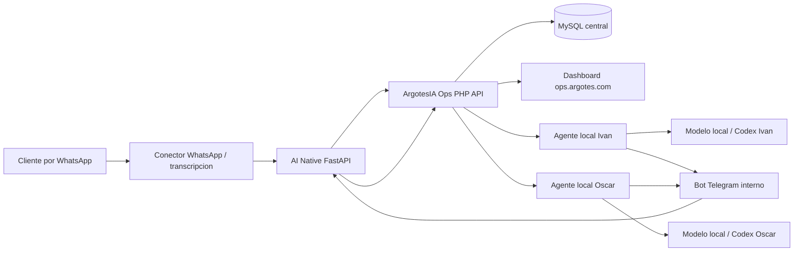

# ArgotesIA Ops: contexto canonico

Este documento es la fuente de verdad para Ivan, Oscar y sus agentes Codex. Reemplaza
mensajes antiguos de Slack que describen etapas ya superadas. Antes de trabajar, leer
este archivo, `AGENTS.md`, `docs/api-contract.md` y el estado actual de Git.

Ultima consolidacion: 2026-07-09.

## Resumen ejecutivo

ArgotesIA Ops es el sistema interno de soporte de Ivan y Oscar. No es el CRM comercial.
Su objetivo es convertir mensajes y audios de clientes en tickets trazables, repartirlos
entre ambos, permitir que sus modelos locales y Codex preparen propuestas tecnicas y
exigir autorizacion humana antes de implementar o hablar con el cliente.

El producto resuelve el cuello de botella original: los clientes escriben principalmente
a Oscar por WhatsApp y el trabajo no se distribuye de forma visible. El dashboard central
es la bandeja compartida y la fuente oficial del estado de cada ticket.

## Principios no negociables

- Los modelos locales y Codex diagnostican y proponen; no implementan sin autorizacion humana.
- No se despliega, reinicia, migra ni modifica un proyecto cliente sin autorizacion explicita.
- Telegram es un canal interno para preguntas y decisiones; no es un canal de cliente.
- `WHATSAPP_AUTO_REPLY=false`: no hay respuestas automaticas a clientes.
- El outbox de cliente existe, pero no se usa hasta habilitar formalmente el flujo de salida.
- Todo cambio de estado, pregunta, respuesta y autorizacion debe quedar auditado.
- Los secretos solo viven en archivos `.env` privados o gestores equivalentes; nunca en Git o Slack.
- El dashboard y la base de datos central son la fuente oficial, no el chat ni la memoria de un agente.

## Arquitectura



## Componentes y responsabilidades

| Componente | Responsabilidad | No debe hacer |
|---|---|---|
| `ops.argotes.com` | Intake, tickets, proyectos, asignacion, propuestas, auditoria y dashboard | Leer WhatsApp directamente o ejecutar cambios en repos clientes |
| `ainative.argotes.com` | Backend FastAPI, control Telegram y puente del conector WhatsApp | Ser la fuente de verdad de tickets |
| `ai-native-whatsapp` | Leer remitentes permitidos, normalizar mensajes, transcribir cuando aplique y enviar intake | Responder automaticamente al cliente |
| Agente local Ivan | Leer tickets de Ivan, usar su ruta local/modelo y subir propuestas | Usar el token de Oscar o implementar sin autorizacion |
| Agente local Oscar | Leer tickets de Oscar, usar su ruta local/modelo y subir propuestas | Usar el token de Ivan o implementar sin autorizacion |
| Bot Telegram | Publicar preguntas internas y registrar aprobar, rechazar o responder | Enviar respuestas a clientes |
| Codex de cada proyecto | Revisar el repo correcto, diagnosticar y proponer una solucion verificable | Confundir este repo con el repo del cliente o desplegar por iniciativa propia |

## Flujo completo

1. El conector recibe un mensaje o audio de un remitente permitido.
2. El conector obtiene texto y envia el intake central con un `external_ref` unico.
3. Ops evita duplicados por `source_channel + external_ref`.
4. Ops resuelve el proyecto usando `project_key` explicito; si no existe, usa telefono y despues alias/texto.
5. Ops crea el ticket y sugiere Ivan para incidentes urgentes y Oscar para el resto, salvo `assigned_worker_key` explicito.
6. Ivan u Oscar pueden reasignar manualmente el ticket desde el dashboard.
7. El agente local del responsable consulta `/api/worker/tasks` con su token propio.
8. El modelo local o Codex prepara diagnostico, plan, pruebas, riesgos y borrador; no aplica cambios.
9. El agente sube la propuesta a `/api/worker/proposals`; el ticket queda en revision.
10. Si falta contexto, el agente publica una pregunta interna mediante Telegram.
11. Ivan u Oscar responden con `/responder`, o deciden con `/aprobar` y `/rechazar`.
12. Una aprobacion valida exige una propuesta `ready`; cambia la propuesta a `approved` y el ticket a `en_progreso`.
13. Solo despues de esa autorizacion una persona puede implementar o autorizar expresamente a Codex.
14. La salida al cliente permanece deshabilitada operativamente hasta una decision posterior.

Invariantes de administracion:

- Un intake puede tener como maximo un ticket. Reintentar “Crear ticket” abre el existente.
- Reasignar modifica `assigned_user_id` del mismo ticket y preserva su estado actual.
- Solo un ticket `nuevo` pasa a `asignado` al recibir su primer responsable.
- Cambiar estado actualiza el mismo ID y registra estado anterior/nuevo en `ticket_events`.

## Estados de ticket

| Estado | Significado |
|---|---|
| `nuevo` | Ticket creado sin responsable |
| `asignado` | Tiene responsable y puede ser recogido por su agente local |
| `en_propuesta` | Reservado para preparacion de propuesta |
| `en_revision` | Existe material para revision humana |
| `aprobado` | Respuesta o decision aprobada para el flujo correspondiente |
| `en_progreso` | Implementacion autorizada y en ejecucion humana/controlada |
| `resuelto` | Solucion aplicada y verificada |
| `cerrado` | Caso terminado |
| `descartado` | No requiere trabajo |

## Identificacion de proyectos

El catalogo central guarda por proyecto:

- `project_key`, nombre y cliente.
- Alias de marca o palabras reconocibles.
- Telefonos del cliente para clasificacion deterministica sin IA.
- Ruta local distinta para Ivan y Oscar.
- Repositorio Git y destino SSH distinto para Ivan y Oscar, sin credenciales.
- Reglas de Codex y contexto operativo completo.

Las fichas se crean y editan desde `Proyectos` en el dashboard. La edicion carga los
valores actuales, actualiza por ID y permite cambiar estado, telefonos, rutas y destinos
SSH sin recrear el proyecto.

Los campos correctos son `server_ssh_ivan` y `server_ssh_oscar`. Cada valor puede ser
un alias definido en `~/.ssh/config` de esa Mac o un `usuario@host`. Ops no guarda
`IdentityFile`, contenido de llaves, passphrases ni copia destinos entre operadores.
El API de tareas transforma esos campos en `server_ssh_target` y `local_path` antes de
responder, y elimina del payload los datos de la otra Mac.

Orden real de resolucion:

1. `project_key` enviado expresamente por la integracion.
2. Coincidencia de `client_contact` contra `client_phones` normalizados.
3. Coincidencia de `project_key`, nombre, cliente o alias en el texto.
4. Proyecto unico activo, solo cuando existe exactamente uno.
5. Sin coincidencia: queda por confirmar.

Proyectos registrados actualmente:

| Key | Proyecto | Cliente | Estado |
|---|---|---|---|
| `argotesia-ops` | ArgotesIA Ops | ArgotesIA | Activo |
| `argodrive` | ArgoDrive | Exclusivos Fusagasuga | Activo; SSH Oscar configurado, SSH Ivan y telefonos pendientes |

## Tokens y secretos

| Variable | Donde vive | Quien la usa | Se comparte entre Macs |
|---|---|---|---|
| `OPS_API_TOKEN` | Servidores Ops y AI Native | Integraciones centrales WhatsApp/Telegram | No |
| `OPS_WORKER_TOKEN` | `.env` privado de cada Mac y usuario central | Agente local de ese usuario | No; Ivan y Oscar tienen valores distintos |
| `TELEGRAM_AGENT_TOKEN` | AI Native y `.env` privados de ambas Macs | Preguntas de agentes locales | Si, por canal privado |
| `TELEGRAM_BOT_TOKEN` | Solo servidor AI Native | API del bot de Telegram | No |
| `TELEGRAM_WEBHOOK_SECRET` | Solo servidor AI Native | Validar webhooks de Telegram | No |

Regla practica: un agente local normal nunca debe pedir `OPS_API_TOKEN`. Si lo pide,
probablemente esta usando la plantilla del servidor en vez de la configuracion del worker.

## Comandos del agente local

Configuracion y proceso exacto de Oscar: `docs/local-agent-oscar.md`.

El worker local es un bridge CLI. No abre Codex ni implementa por si mismo. En modo
automatico llama al modelo local y sube una propuesta; en modo Codex, el agente usa
`tasks`, inspecciona el repo cliente en solo lectura y sube el resultado con `submit`.

Cada Mac configura las mismas variables, cambiando `OPS_WORKER_KEY`,
`OPS_WORKER_TOKEN`, ruta y modelo local.

Leer respuestas y autorizaciones:

```bash
php scripts/mac-agent.php updates 0
```

Listar tickets sin generar propuestas:

```bash
php scripts/mac-agent.php tasks
```

Subir una propuesta preparada por Codex:

```bash
php scripts/mac-agent.php submit OPS-2026-00042 proposal.md
```

Procesar tickets asignados y subir propuestas:

```bash
php scripts/mac-agent.php
```

Hacer una pregunta interna:

```bash
php scripts/mac-agent.php ask OPS-2026-00042 "Pregunta concreta para Ivan/Oscar."
```

Solicitar autorizacion para una propuesta ya lista:

```bash
php scripts/mac-agent.php ask OPS-2026-00042 "Propuesta lista para decision." --authorize
```

El worker debe guardar `next_since_id` al consumir actualizaciones para evitar repetir eventos.

## Comandos Telegram

```text
/ayuda
/responder OPS-2026-00042 respuesta interna
/aprobar OPS-2026-00042
/rechazar OPS-2026-00042 motivo
```

`/aprobar` y `/rechazar` operan sobre la propuesta mas reciente y solo aceptan usuarios
incluidos en `TELEGRAM_USER_WORKER_MAP`.

## API central

Contrato completo: `docs/api-contract.md`.

| Proposito | Metodo y ruta |
|---|---|
| Crear intake/ticket | `POST /api/intake/messages` |
| Leer tareas del worker | `GET /api/worker/tasks` |
| Subir propuesta local | `POST /api/worker/proposals` |
| Leer respuestas/decisiones | `GET /api/worker/updates` |
| Registrar acciones Telegram | `POST /api/tickets/telegram-actions` |
| Consultar salida aprobada | `GET /api/outbox/client-replies` |
| Confirmar salida enviada | `POST /api/outbox/client-replies/ack` |

En produccion, usar las URLs con `index.php?r=%2F...` documentadas en el contrato.

## Produccion

| Servicio | Ubicacion |
|---|---|
| Dashboard/API central | `https://ops.argotes.com` |
| Backend AI Native | `https://ainative.argotes.com` |
| App PHP privada | `/home/argotes-ops/app` |
| Webroot PHP | `/home/argotes-ops/htdocs/ops.argotes.com` |
| AI Native | `/home/blueprint/apps/ai-native` |
| PM2 backend | `ai-native-backend` |
| PM2 WhatsApp | `ai-native-whatsapp` |

Estado verificado al consolidar este documento:

- `ai-native-backend`: online.
- `ai-native-whatsapp`: online.
- `https://ainative.argotes.com/health`: OK en produccion.
- `OPS_CREATE_TICKET=true`.
- `WHATSAPP_AUTO_REPLY=false`.
- Telegram funciona desde las dos partes.
- Los agentes locales de Ivan y Oscar autentican contra Ops.

## Repositorio y flujo Git

Repositorio: `git@github.com:iargotes/argotesia-ops.git`.

Flujo acordado:

1. Partir de `main` actualizado.
2. Trabajar en una rama corta.
3. Ejecutar validaciones relevantes.
4. Integrar a `main` cuando este listo.
5. Hacer push de `main`.
6. Desplegar solo si el cambio corresponde a Ops y esta autorizado.
7. Eliminar la rama corta despues del merge.

No usar mensajes viejos de Slack como fuente de commit o rama actual. Confirmar siempre con:

```bash
git fetch origin
git status --short --branch
git rev-list --left-right --count origin/main...main
git log -5 --oneline --decorate
```

## Mapa del repositorio

| Ruta | Contenido |
|---|---|
| `public/index.php` | Dashboard y endpoints PHP centrales |
| `app/Core/Classifier.php` | Clasificacion, proyecto y asignacion sugerida |
| `database/schema.sql` | Esquema base |
| `database/migrate_*.sql` | Migraciones idempotentes |
| `scripts/mac-agent.php` | Worker comun para ambas Macs |
| `scripts/ops-agent-ivan.sh` | Lanzador local especifico de Ivan |
| `scripts/ops-agent-oscar.sh` | Lanzador local especifico de Oscar |
| `scripts/setup-oscar-agent.sh` | Valida configuracion y autenticacion de Oscar |
| `scripts/install-oscar-agent.sh` | Instala el modo modelo local cada 60 segundos |
| `scripts/register-project.php` | Registro de fichas JSON de proyectos |
| `integrations/ai-native-whatsapp/` | FastAPI, Telegram y conector WhatsApp |
| `docs/api-contract.md` | Contrato estable de integraciones |

Ejemplo seguro de una ficha de proyecto:

```json
{
  "server_ssh_ivan": "argodrive-prod-ivan",
  "server_ssh_oscar": "argodrive-prod-oscar"
}
```

Cada alias se resuelve localmente en la Mac correspondiente:

```sshconfig
Host argodrive-prod-oscar
  HostName 2.24.119.113
  User usuario-de-oscar
  IdentityFile ~/.ssh/llave-de-oscar
  IdentitiesOnly yes
```

El archivo `~/.ssh/config` y la llave nunca se copian al repo, dashboard o Slack.

## Estado actual y siguientes pasos

Completado:

- Dashboard, usuarios, tickets, proyectos y modo oscuro.
- Intake idempotente y creacion automatica de tickets.
- WhatsApp y AI Native conectados al Ops central.
- Telegram interno con preguntas, respuestas, aprobacion y rechazo.
- Workers locales autenticados para Ivan y Oscar.
- Propuestas locales y aprobacion humana auditada.
- ArgoDrive registrado con rutas, repo, SSH, reglas y alias.

Pendiente inmediato:

- Cargar `client_phones` de ArgoDrive y de cada proyecto para evitar clasificacion por IA.
- Registrar los otros proyectos/clientes con el mismo JSON canonico.
- Confirmar ejecucion periodica en segundo plano de ambos workers.
- Ejecutar un ticket real completo desde WhatsApp hasta propuesta y autorizacion.
- Mantener deshabilitada la respuesta al cliente durante esta fase.

## Checklist para cualquier agente nuevo

1. Confirmar que esta en el repo `argotesia-ops` y no en un repo cliente.
2. Leer `AGENTS.md`, este documento y `docs/api-contract.md`.
3. Ejecutar `git status` y comparar `main` con `origin/main`.
4. Identificar si trabaja en central PHP, AI Native o worker local.
5. Identificar si el token requerido es de integracion, worker o Telegram.
6. No pedir ni publicar valores secretos.
7. No responder clientes ni implementar cambios sin autorizacion.
8. Reportar evidencia: ruta, endpoint, estado Git, prueba y resultado.

Si otro documento o mensaje contradice este archivo, detenerse, verificar el codigo actual
y actualizar esta fuente canonica antes de continuar.
